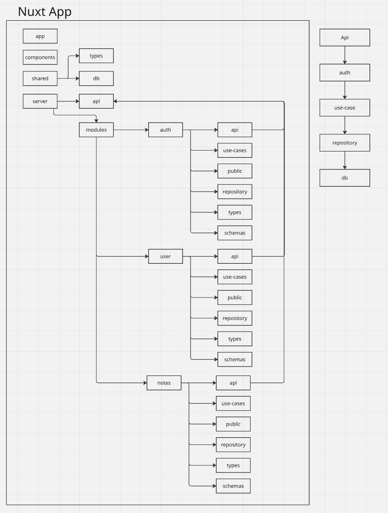

# ADR-0003: Architecture vision

## Context

Придя к тому, что я буду реализовывать fullstack приложение на Nuxt, \
мне стало необходимо разобраться в архитектуре бэкэнда и продумать таковую для моего приложения.

Так как приложение планируется развивать как долгоживущий проект с постепенным расширением функциональности, \
было принято решение заранее определить базовые архитектурные принципы организации кода.

Основная задача архитектуры — обеспечить:
* разделение ответственности между различными частями системы;
* возможность масштабирования функциональности без значительного усложнения структуры проекта;
* изоляцию бизнес-логики от деталей реализации;
* удобство дальнейшей поддержки и изменения отдельных компонентов.

Были рассмотрены следующие архитектурные подходы:

## Options

* Feature-based Architecture
* Layered Architecture
* Vertical Slice Architecture
* Hexagonal Architecture
* Clean Architecture

## Decision

На данный момент я склоняюсь к некой комбинации этих архитектур \
Мне очень нравится подход из Clean architecture - внешний код зависит от внутреннего, 
но внутренний ничего не знает о внешнем.

Мы имеем обязательную точку входа из Nuxt - папка **server/api**, о ней чуть позже. \
На верхнем уровне у нас элемент из Feature Based, один модуль - одна бизнес область, \
внутри каждого модуля файл со списком api ручек этого модуля, \
вот тут возвращаемся к **server/api**, он импортит в себя все api файлы из каждого модуля.

На данный момент представляется идеальная картина - каждая api ручка есть один use-case приложения, \
вот тут элемент из Vertical Slice architecture, use-case есть бизнес логика какого-то конкретного кейса, \
далее вниз уже идёт работа с бд.

Также существует папка **public**, в ней **index.ts** в котором импортированы use-cases, \
они, в свою очередь, могут быть использованы в других модулях. \
Если какой-либо use-case не импортирован в **public** использовать его в другом модуле нельзя.

## Consequences

### Positive

- Функциональные области приложения имеют четкие границы.
- Код, относящийся к одной бизнес-возможности, находится в одном месте.
- Упрощается дальнейшее масштабирование проекта.
- Бизнес-логика становится менее зависимой от конкретных технологий.
- Архитектура позволяет постепенно усложнять приложение по мере роста требований.

### Negative

- На начальном этапе потребуется больше времени на проектирование структуры.
- Возможно появление избыточных абстракций для простых сценариев.
- Потребуется внимательно определять границы между модулями.

## Status

На данный момент этот архитектурный подход является гипотезой, в процессе реализация он может быть пересмотрен.

Основная цель — проверить практическую применимость данного подхода в реальном приложении и определить, \
какие элементы архитектуры действительно необходимы.

